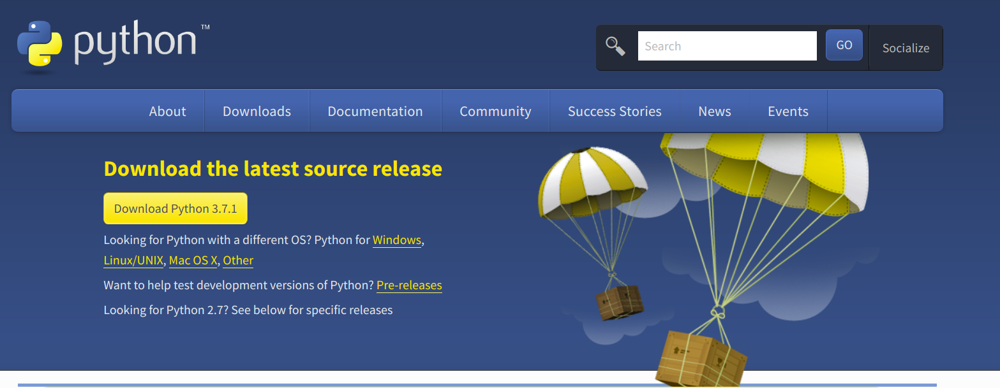

# Python Environment Setup

## Installation

In python we have many ways to install python in your machine. Let's start with the popular method

> **Windows**

#### **Step 1: Download**

Go to [https://www.python.org/downloads/](https://www.python.org/downloads/) and then download



#### Step 2: Installing

**Important note: Please checkout "Add Python 3.7 to PATH"**


#### Step 3: Enjoy Python!

Open your **cmd.ex**e or **PowerShall** \( In linux, we called Terminal \) 

To check python install properly, just type following command

```bash
python3 --version
```

you should got a python version statement as its output.

#### Step 4: Install Pip, the package manager

```bash
curl https://bootstrap.pypa.io/get-pip.py -o get-pip.py
```

```bash
python get-pip.py
```

if not work, plase go to [https://pip.pypa.io/en/stable/installing/](https://pip.pypa.io/en/stable/installing/) for more infomation

## Setting up a Virtual Environment \(venv\)

To specify environment to each projects or we can say that we're avoiding dependency problem. the best solution in python is **"Virtualenvironment"**

#### Virtual Environment Installation

```bash
pip3 install virtualenv
```

in case yo don't have a permission please use the code below insted,

```text
pip3 install virtualenv --user
```

#### Usages

Create new virtual environment

```bash
virtualenv .venv -p python3
```

Active a virtual environment

```bash
source .venv/bin/activate
```

To Deactivate

```text
deactivate
```

Now, your machine is ready to build the awesomes things with Python.   
In the next chapter, we will take you tour to the first application in Python Enjoy!

